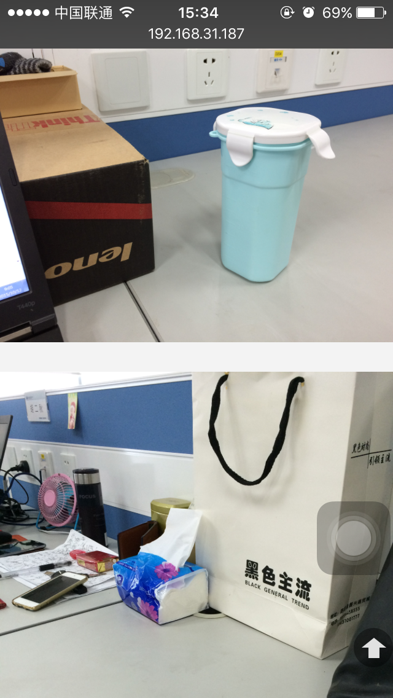
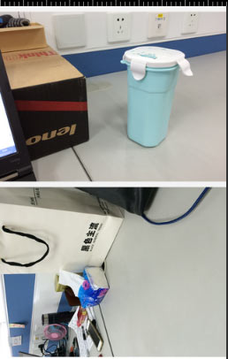

##iOS里面对竖拍的图片展示位竖的，Android里面展示位横的
```html
<h2>竖拍的图片</h2>
<div class="item-pic"></div>
<h2>横拍的图片</h2>
<div class="item-pic"></div>
```
#####iOS里面两张图片都显示正常方向

#####Android里面竖拍的图片的显示的方向不对


    
iOS里面自动旋转图片应正确显示图片,此时问题来了，图片旋转了，长宽没有跟着一块改变。
