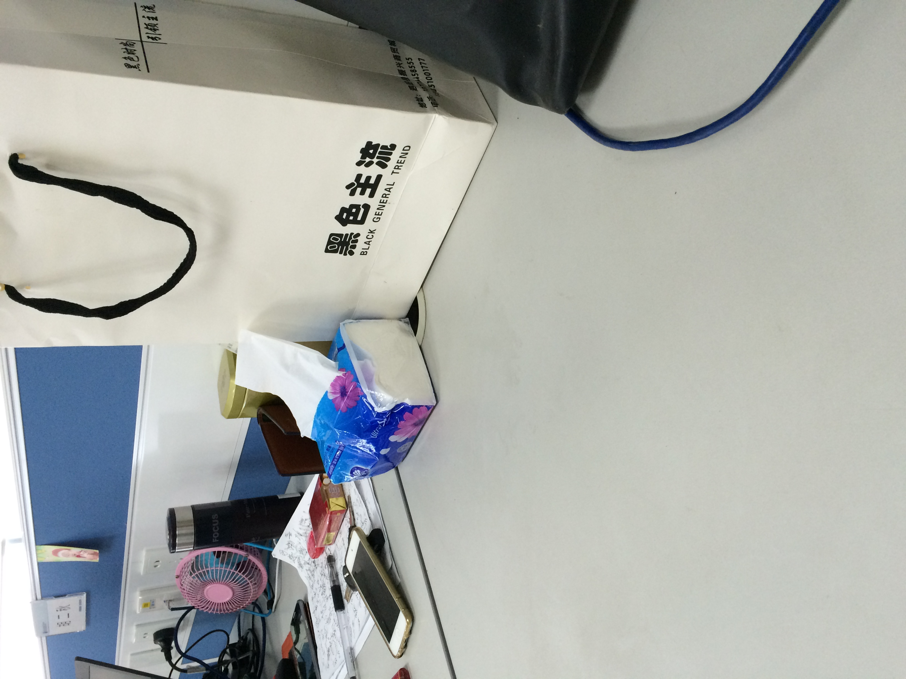
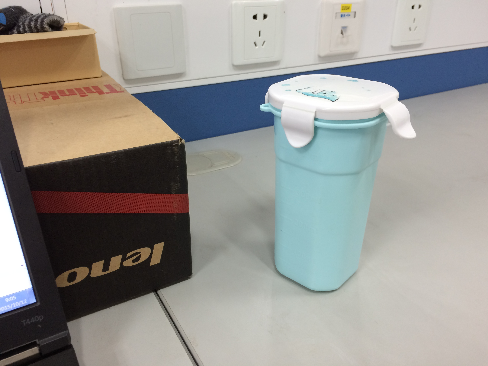

##iOS里面对竖拍的图片展示位竖的，Android里面展示位横的
```html
<h2>竖拍的图片</h2>
<div class="item-pic"></div>
<h2>横拍的图片</h2>
<div class="item-pic"></div>
```
####iOS里面两张图片都显示正常方向(iOS里面方向变了，图片的长度和宽度没有变化)
####Android里面竖拍的图片的显示的方向不对
